# Distributed Vulnerability Scan Orchestration Engine

## Software Architecture & Design Document

**Version:** 1.0
**Component Owner:** Control Plane, Database Design, Scheduling Engine

---

# Table of Contents

1. Introduction
2. System Overview
3. Project Objectives
4. Scope Definition
5. Architectural Principles
6. High-Level System Architecture
7. Control Plane Architecture
8. Scanner Plane Architecture
9. Scanner Tool Execution Details
10. Technology Stack Decision
11. System Components
12. Orchestrator Engine Design
13. Scheduler Design Overview
14. Distributed Lock Management
15. Deadlock Prevention Strategy
16. Scan Lifecycle
17. Job State Machine
18. Scan Pipeline (DAG)
19. Job Queue Design
20. Scheduler Algorithm
21. Retry Strategy
22. Agent Registration & Heartbeat
23. Job Dispatch Flow
24. Complete Scan Sequence
25. Redis Key Design
26. Failure Recovery
27. Database Architecture Overview
28. Database Design Principles
29. Entity Relationship Diagram
30. Organizations Table
31. Users Table
32. Assets Table
33. Agent Management
34. Scan Request Model
35. Scan Execution Model
36. Job Management
37. Job Execution History
38. Database Relationships
39. Indexing Strategy
40. Findings Management
41. Vulnerability Normalization Model
42. CVSS Scoring Model
43. PCI Automatic Failure Rules
44. Remediation Engine
45. ASV Operational Workflow
46. Dispute and Exception Workflow
47. Report Management
48. Report Storage Architecture
49. Three-Year Retention Policy
50. Quarterly Scan Scheduling
51. Audit Logging
52. Scheduler Event Tracking
53. Final Database Relationship Diagram
54. Database Design Summary
55. API Architecture
56. REST API Design
57. Authentication and Authorization
58. Scan Management APIs
59. Agent Communication Protocol
60. Agent Execution Contract
61. Result Upload Protocol
62. Security Architecture
63. Deployment Architecture
64. Container Architecture
65. Scaling Strategy
66. High Availability Design
67. Monitoring and Observability
68. Logging Architecture
69. Future Improvements

---

# 1. Introduction

## 1.1 Background

A modern vulnerability assessment platform requires multiple security scanners working together to analyze an organization's infrastructure.

Different scanners specialize in different areas:

- Network discovery
- Port scanning
- Service enumeration
- Vulnerability detection
- TLS analysis
- Custom security checks

Examples:

- Nmap
- OWASP ZAP
- Nuclei
- OpenVAS
- testssl.sh
- Custom Python security plugins

However, scanner tools alone cannot provide a complete enterprise scanning platform.

A centralized orchestration layer is required to:

- Schedule scans
- Manage scanner agents
- Prevent conflicting executions
- Track scan lifecycle
- Handle failures
- Store historical data
- Generate compliance reports

This project focuses on designing this orchestration layer.

---

# 1.2 Purpose

The purpose of this project is to design a distributed vulnerability scan orchestration engine that provides:

- Automated scan scheduling
- Distributed agent management
- Target-level concurrency control
- Fault-tolerant execution
- Job lifecycle management
- Compliance reporting support
- Long-term scan history storage

The platform follows a **control plane and scanner plane architecture**.

---

---

# 2. System Overview

The platform consists of two major layers.

---

# 2.1 Control Plane

The control plane acts as the brain of the system.

Responsibilities:

- Accept scan requests
- Create execution workflows
- Schedule jobs
- Manage locks
- Assign scanner agents
- Track progress
- Store metadata
- Generate reports

Components:

- API Service
- Orchestrator
- Scheduler
- Lock Manager
- PostgreSQL Database
- Redis Queue
- Report Engine

---

# 2.2 Scanner Plane

The scanner plane performs actual security testing.

Responsibilities:

- Execute security tools
- Collect raw results
- Upload findings
- Report execution status

Components:

- External Scanner Agents
- Internal Scanner Agents

Tools:

- Nmap + NSE
- OWASP ZAP
- Nuclei
- OpenVAS
- testssl.sh
- Custom Python Plugins

---

# 3. Project Objectives

## 3.1 Functional Objectives

The system should:

- Accept user scan requests.
- Divide scans into asset-level jobs.
- Schedule jobs across agents.
- Prevent duplicate scans on the same asset.
- Support external and internal scanning.
- Retry failed executions.
- Maintain execution history.
- Generate compliance reports.
- Support quarterly recurring scans.
- Retain reports for three years.

---

# 3.2 Non-Functional Objectives

| Requirement | Description |
|---|---|
| Reliability | Recover from agent and service failures |
| Scalability | Support multiple agents and organizations |
| Security | Secure authentication and communication |
| Maintainability | Modular service architecture |
| Availability | Continue operation during failures |
| Performance | Efficient job scheduling |
| Observability | Logs, metrics, audit tracking |

---

# 4. Scope Definition

## 4.1 Components Designed In This Project

This project covers:

### Orchestration Engine

Responsible for:

- Workflow creation
- Job scheduling
- Agent selection
- Lock management
- Retry handling

### Database Layer

Responsible for:

- Asset storage
- Scan history
- Job tracking
- Findings metadata
- Reports

### Scheduler

Responsible for:

- Queue processing
- Agent assignment
- Periodic scans
- Failure recovery

### Distributed Lock Manager

Responsible for:

- Target exclusivity
- Deadlock prevention
- Lock expiration

---

# 4.2 Components Outside Scope

The following components are executed by scanner agents:

- Nmap implementation
- OWASP ZAP implementation
- Nuclei implementation
- OpenVAS implementation
- TLS scanner implementation
- Vulnerability detection logic

The orchestrator only manages execution.

---

# 5. Architectural Principles

## 5.1 Separation of Responsibilities

The system separates:

```
Decision Making

and

Execution
```

The orchestrator decides:

- What should run?
- When should it run?
- Which agent should execute?

Scanner agents decide:

- How the tool executes
- How results are collected

---

# 5.2 Database as Source of Truth

PostgreSQL stores all durable information.

Example:

Redis:

```
Job currently running
```

PostgreSQL:

```
Job ID
Assigned Agent
Execution Time
Current State
```

If Redis fails, the system can recover.

---

# 5.3 Asynchronous Execution

Scanning operations can take minutes or hours.

Therefore:

```
API Request

↓

Create Scan

↓

Background Execution

↓

Report Generation
```

The user does not wait for completion.

---

# 6. High-Level System Architecture

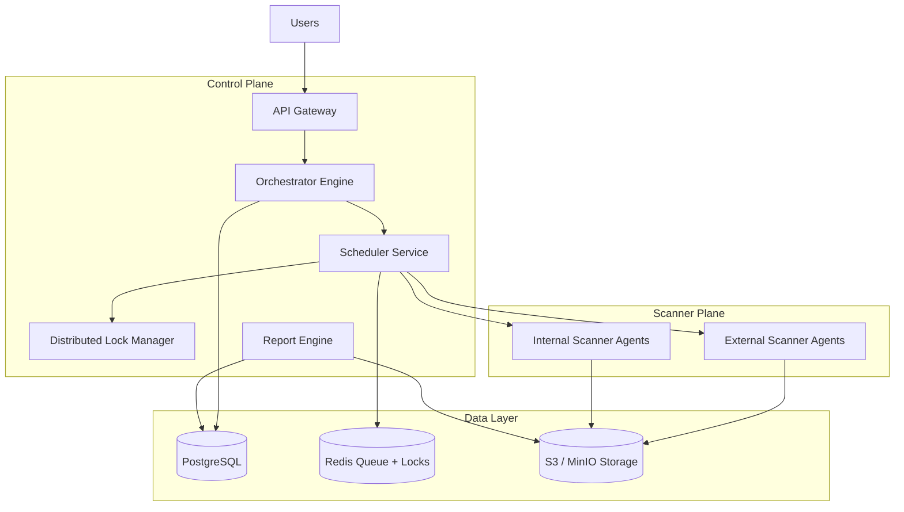

---

# 7. Control Plane Architecture

The control plane manages the complete scan lifecycle.

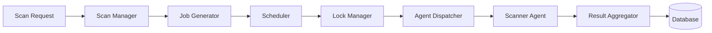

---

# Control Plane Responsibilities

| Component | Responsibility |
|-|-|
| API | User interaction |
| Orchestrator | Workflow management |
| Scheduler | Job execution decisions |
| Lock Manager | Target protection |
| Database | Persistent state |
| Report Engine | Compliance output |

---

# 8. Scanner Plane Architecture

Scanner agents are independent workers.

They receive jobs from the orchestrator and execute scanning pipelines.

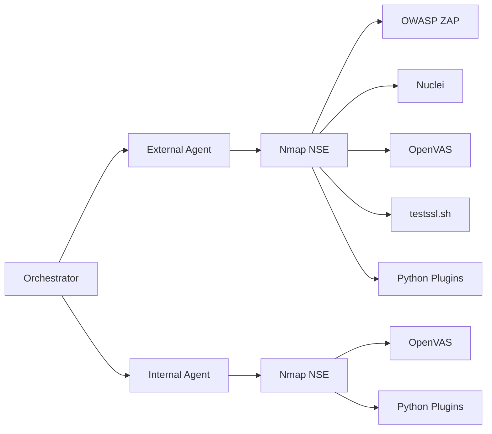

---

# 9. Scanner Tool Execution Details

This section describes exactly how each scanning tool executes internally, stage by stage, and what information each stage produces for downstream consumption.

## 9.1 Nmap

| Step | Stage | Tool/Command | Purpose | Action Performed | Information Produced |
|---|---|---|---|---|---|
| N1 | Host Discovery | nmap -sn | Verify whether the target system is reachable | Sends discovery probes to determine host availability | Live hosts and reachable IP addresses |
| N2 | Port Discovery | nmap -Pn -p- | Identify exposed network ports | Scans the full port range to detect open ports | Open, closed, and filtered ports |
| N3 | Service Detection | nmap -sV | Identify running services | Communicates with services and determines application types and versions | Service names and versions |
| N4 | OS Fingerprinting | nmap -O | Identify operating system | Analyzes network behavior and fingerprints the host OS | Operating system information |
| N5 | NSE Security Checks | nmap --script vuln | Perform basic vulnerability checks | Executes Nmap Security Scripts against detected services | Misconfigurations and basic vulnerabilities |
| Output | Asset Inventory | Nmap Results | Create a baseline inventory for all later scanners | Consolidates discovered host information | Hosts, ports, services, OS details, security observations |

Nmap output forms the **baseline asset inventory** that every downstream scanner (OWASP ZAP, Nuclei, OpenVAS, testssl.sh, Python plugins) consumes before running its own checks.

---

## 9.2 OWASP ZAP

| Step | Stage | Purpose | Action Performed | Information Produced |
|---|---|---|---|---|
| Z1 | Spidering | Discover web application content | Crawls accessible pages and links | URLs, endpoints, forms |
| Z2 | Passive Analysis | Identify security issues without affecting the application | Reviews responses, headers, cookies, and configurations | Missing headers, cookie issues, information disclosure |
| Z3 | Active Testing | Detect exploitable vulnerabilities | Sends controlled test requests to the application | SQL Injection, XSS, Path Traversal, Command Injection findings |
| Z4 | Result Export | Standardize findings for processing | Exports identified issues | Structured vulnerability findings |

---

## 9.3 Nuclei

| Step | Stage | Purpose | Action Performed | Information Produced |
|---|---|---|---|---|
| N1 | Template Loading | Load security checks | Loads vulnerability templates from template repository | Available test definitions |
| N2 | Technology Matching | Select relevant tests | Maps templates to detected technologies | Targeted testing plan |
| N3 | Request Execution | Verify exposures and weaknesses | Sends requests defined by templates | Application responses |
| N4 | Signature Matching | Detect known issues | Compares responses against vulnerability signatures | Confirmed findings |
| N5 | Result Export | Forward findings for analysis | Exports findings in structured format | Vulnerability records and severity data |

---

## 9.4 OpenVAS

| Step | Stage | Purpose | Action Performed | Information Produced |
|---|---|---|---|---|
| O1 | Host Profiling | Understand target environment | Consumes service and version data from Nmap | Service inventory |
| O2 | Test Selection | Choose relevant vulnerability tests | Selects checks based on detected technologies | Target-specific testing plan |
| O3 | Vulnerability Assessment | Identify known vulnerabilities | Executes extensive vulnerability tests | Security findings |
| O4 | CVE Mapping | Associate findings with known vulnerabilities | Maps affected software to CVEs | CVE references |
| O5 | Result Export | Deliver findings for correlation | Exports assessment results | Vulnerability reports and evidence |

OpenVAS explicitly depends on the Nmap-produced service inventory (O1) before selecting its test plan, confirming the strict Nmap-before-OpenVAS dependency defined in the pipeline DAG (§18).

---

## 9.5 testssl.sh

| Step | Stage | Purpose | Action Performed | Information Produced |
|---|---|---|---|---|
| T1 | TLS Connection | Verify TLS availability | Establishes connection to TLS-enabled services | TLS endpoint information |
| T2 | Protocol Analysis | Identify supported TLS versions | Tests supported protocol versions | Supported and deprecated protocols |
| T3 | Cipher Assessment | Evaluate encryption strength | Enumerates available ciphers | Cipher inventory |
| T4 | Certificate Validation | Review certificate configuration | Checks issuer, validity period, and trust chain | Certificate details and issues |
| T5 | Result Export | Provide findings for analysis | Generates security report | TLS configuration findings |

---

## 9.6 Custom Plugins

| Step | Module | Purpose | Action Performed | Information Produced |
|---|---|---|---|---|
| P1 | Cookie Audit | Review session security | Evaluates cookie security attributes | Missing HttpOnly, Secure, SameSite flags |
| P2 | Admin Discovery | Locate administrative interfaces | Searches common administrative paths | Administrative endpoints |
| P3 | Database Exposure | Detect exposed databases | Tests accessibility of database services | Exposed database findings |
| P4 | SMB Assessment | Evaluate SMB security posture | Checks SMB configurations and weaknesses | SMB security findings |
| Output | Plugin Results | Extend scanner coverage | Executes specialized checks | Additional security findings |

---

## 9.7 Aggregator

| Step | Stage | Purpose | Action Performed | Information Produced |
|---|---|---|---|---|
| A1 | Parsing | Standardize scanner outputs | Converts multiple formats into a common structure | Normalized findings |
| A2 | Deduplication | Remove duplicate findings | Compares and merges repeated issues | Consolidated findings |
| A3 | Asset Correlation | Link findings to assets | Associates findings with hosts, ports, and services | Contextualized vulnerability inventory |

---

## 9.8 CVSS

| Step | Stage | Purpose | Action Performed | Information Produced |
|---|---|---|---|---|
| CV1 | CVE Mapping | Identify vulnerability references | Associates findings with CVE identifiers | CVE-linked findings |
| CV2 | Risk Scoring | Determine severity | Retrieves and applies CVSS scores | Severity ratings |
| CV3 | Compliance Evaluation | Assess compliance impact | Applies PCI and policy rules | Compliance status |
| CV4 | Final Risk Assessment | Produce final risk rating | Combines severity and compliance information | Final risk classification |

---

## 9.9 Report Engine

| Step | Stage | Purpose | Action Performed | Information Produced |
|---|---|---|---|---|
| R1 | Executive Summary | Present high-level results | Calculates overall statistics | Critical, High, Medium, Low counts |
| R2 | Detailed Analysis | Provide technical evidence | Compiles findings, evidence, and remediation guidance | Detailed findings |
| R3 | Report Generation | Produce deliverables | Generates exportable reports | PDF, CSV, JSON reports |

---

## 9.10 Storage and Dashboard

| Step | Component | Purpose | Action Performed | Information Produced |
|---|---|---|---|---|
| S1 | AWS S3 Storage | Retain generated reports | Stores completed reports and artifacts | Archived scan results |
| D1 | Dashboard Processing | Present results to users | Retrieves scan summaries and findings | Scan status and metrics |
| D2 | Report Access | Allow report retrieval | Provides downloadable reports | PDF, CSV, JSON downloads |

---

# 10. Technology Stack Decision

## 10.1 Orchestrator Language Decision

The orchestrator requires:

- Strong typing
- Large codebase maintainability
- Reliable state handling
- API contracts

Recommended:

```
TypeScript
```

Reasons:

- Strong type system
- Excellent backend ecosystem
- Safer refactoring
- Better interface definitions

---

## 10.2 Scanner Agent Language Decision

Scanner agents use:

```
Python
```

Reasons:

- Excellent security tooling support
- Easy integration with scanners
- Large cybersecurity ecosystem

---

# Final Architecture Decision

```
TypeScript
    |
    |
Orchestrator + Scheduler + API

Python
    |
    |
Scanner Agents
```

---

# 11. System Components

## 11.1 API Service

Responsibilities:

- Authentication
- Authorization
- Scan requests
- Report retrieval

---

## 11.2 Orchestrator Engine

The orchestrator is the central decision-making component.

Responsibilities:

- Convert requests into workflows
- Create jobs
- Manage dependencies
- Track execution

---

## 11.3 Scheduler

The scheduler continuously evaluates:

- Pending jobs
- Agent availability
- Target locks
- Priority

---

## 11.4 Database

PostgreSQL stores:

- Organizations
- Users
- Assets
- Agents
- Scans
- Jobs
- Findings
- Reports

---

# 12. Orchestrator Engine Design

The orchestrator follows a workflow-driven model.

Input:

```
Scan Request
```

Processing:

```
Asset Discovery

↓

Job Creation

↓

Scheduling

↓

Execution

↓

Aggregation

↓

Report
```

---

# Orchestrator Workflow

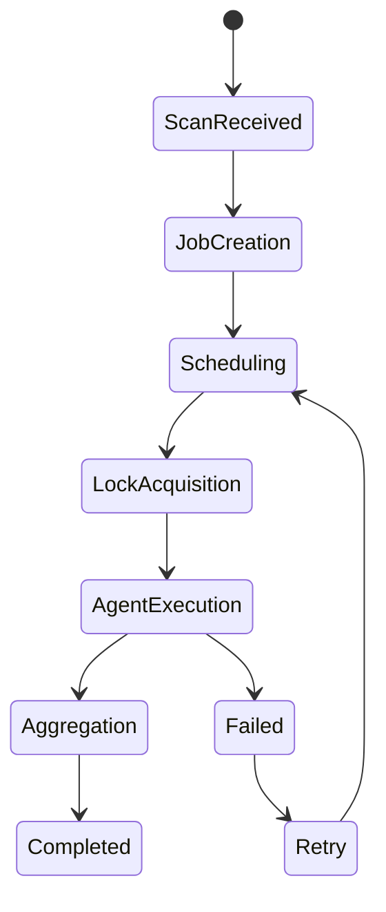

---

# 13. Scheduler Design Overview

The scheduler runs continuously.

Main responsibilities:

- Select pending jobs
- Check dependencies
- Select agents
- Acquire locks
- Dispatch execution

Scheduler loop:

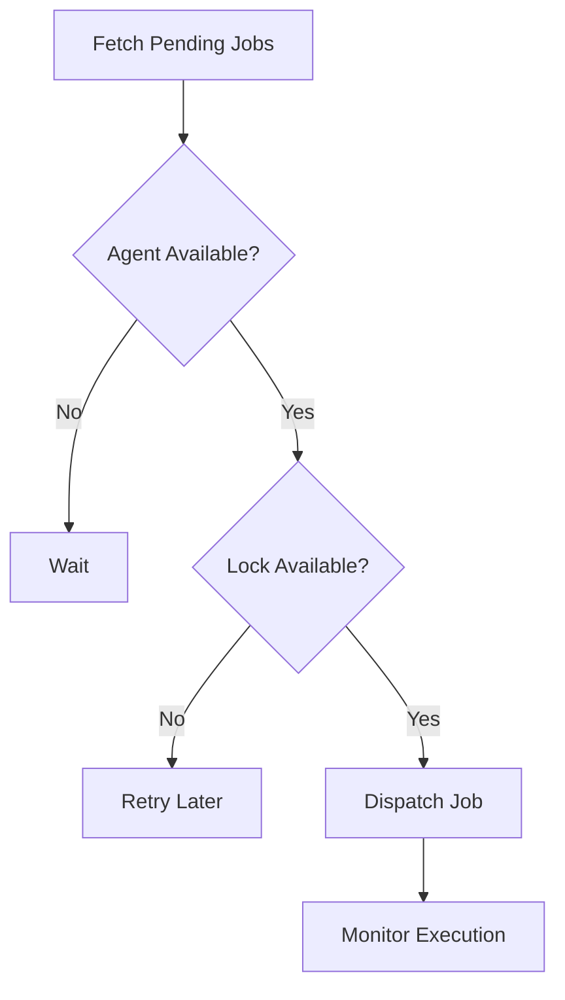

---

# 14. Distributed Lock Management

## Problem

Multiple jobs may attempt to scan the same target.

Example:

```
Job A → Server01

Job B → Server01
```

Running both simultaneously may:

- Trigger security controls
- Produce inaccurate results
- Violate PCI scanning rules

---

# Solution

Use target-level distributed locks.

Lock format:

```
lock:asset:<asset_id>
```

Example:

```
lock:asset:12345
```

Implementation:

Redis:

```
SET key value NX EX ttl
```

---

# Lock Lifecycle

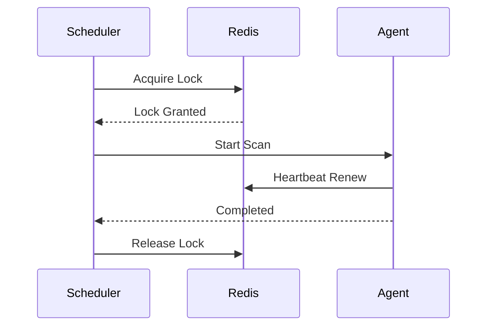

---

# 15. Deadlock Prevention Strategy

Traditional deadlock requires:

1. Mutual exclusion
2. Hold and wait
2. No preemption
3. Circular wait

The system removes deadlock conditions.

---

# Strategy 1: Single Target Lock

One lock per asset.

Example:

```
lock:asset:<id>
```

---

# Strategy 2: Ordered Lock Acquisition

If multiple assets are required:

Example:

```
Asset A

Asset B
```

Always acquire:

```
A → B
```

Never:

```
B → A
```

This removes circular dependency.

---

# Strategy 3: Non-Blocking Lock

Workers never wait.

If unavailable:

```
Job

↓

Retry Queue

↓

Backoff

↓

Try Again
```

---

# Strategy 4: TTL Expiration

Locks automatically expire.

Example:

```
TTL = 2 hours
```

If an agent crashes:

```
Agent failure

↓

TTL expires

↓

Lock released

↓

Job retried
```

---

# Deadlock Prevention Summary

| Deadlock Condition | Solution |
|-|-|
| Mutual Exclusion | Required for scanning |
| Hold and Wait | Removed using non-blocking locks |
| No Preemption | Removed using TTL |
| Circular Wait | Removed using ordered locking |

---

# 16. Scan Lifecycle

A scan request represents a high-level operation initiated by a user.

The orchestrator decomposes the scan into smaller jobs, where each job corresponds to a single asset.

Example:

A customer submits:

```
Scan Request

10 Assets
```

The orchestrator transforms it into:

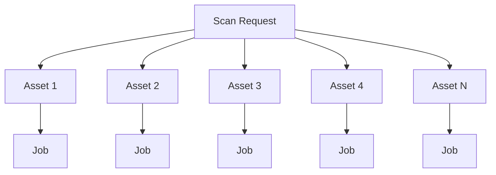

Each job progresses independently through the scheduling pipeline.

---

# 17. Job State Machine

Every job follows a deterministic lifecycle.

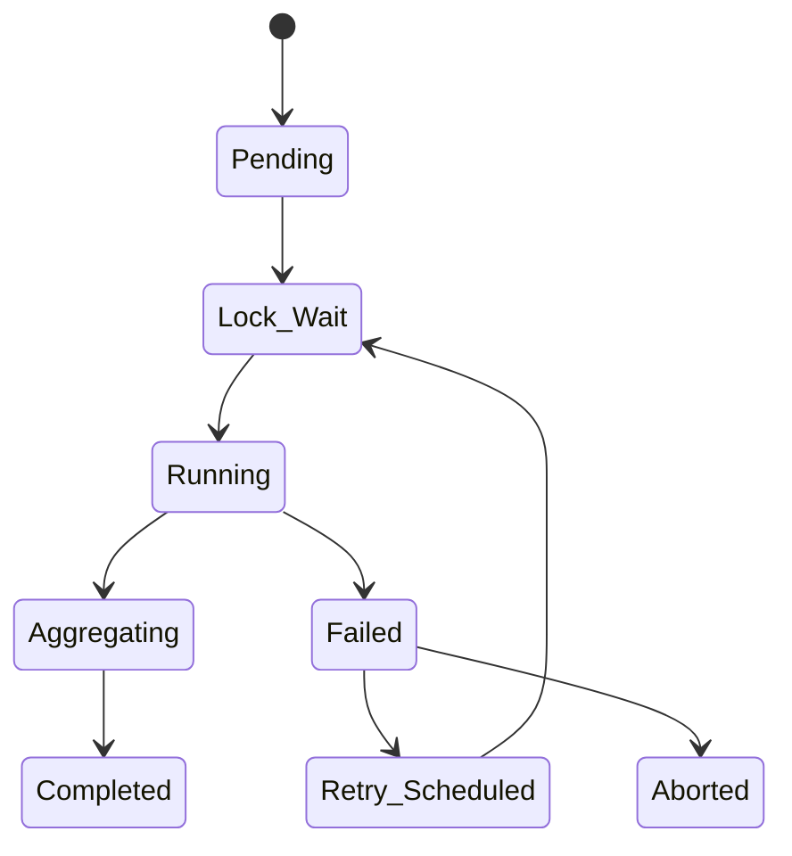

---

## State Descriptions

### Pending

Job exists but has not yet been considered by the scheduler.

---

### Lock Wait

Scheduler is attempting to acquire the target lock.

---

### Running

Scanner agent is executing the assigned pipeline.

---

### Aggregating

Raw outputs are being normalized into the findings database.

---

### Completed

Pipeline completed successfully.

---

### Failed

Scanner or infrastructure error occurred.

---

### Retry Scheduled

Scheduler calculated a retry time.

---

### Aborted

Retry limit exceeded.

---

# 18. Scan Pipeline (Directed Acyclic Graph)

Each asset executes an independent Directed Acyclic Graph (DAG).

## External Scan Pipeline

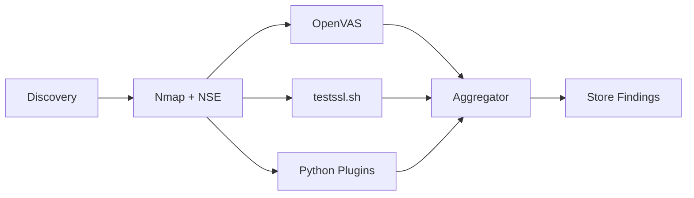

---

## Internal Scan Pipeline

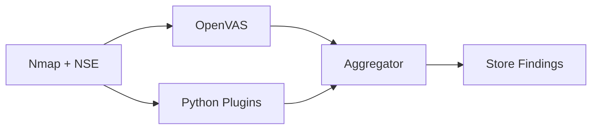

---

## Pipeline Dependencies

Nmap must finish before:

- OpenVAS
- testssl
- Plugins

Aggregator waits for every stage to complete.

---

# 19. Job Queue Design

Redis maintains the scheduling queue.

Jobs are pushed into:

```
queue:pending
```

Scheduler continuously consumes jobs.

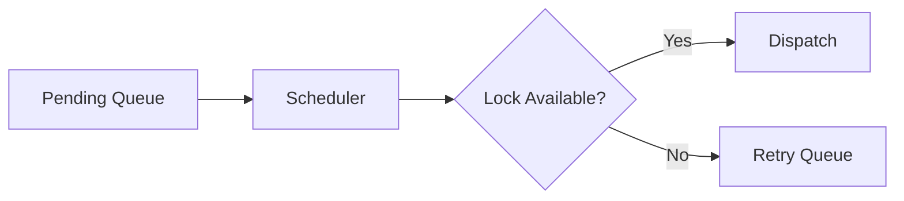

---

## Queue Types

| Queue | Purpose |
|---------|----------|
| queue:pending | New jobs |
| queue:running | Active jobs |
| queue:retry | Failed jobs awaiting retry |
| queue:completed | Recently completed jobs |

---

# 20. Scheduler Algorithm

The scheduler executes continuously.

Pseudo Algorithm

```text
Loop forever

Fetch pending job

↓

Find suitable agent

↓

Acquire Redis lock

↓

Dispatch job

↓

Update database

↓

Wait for completion

↓

Release lock

Repeat
```

---

## Scheduling Conditions

A job can execute only when:

✔ Agent online

✔ Capacity available

✔ Lock acquired

✔ Dependencies completed

Otherwise:

Return job to queue.

---

## Scheduler Flow

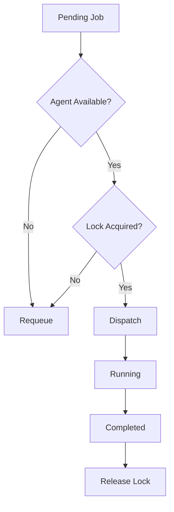

---

# 21. Retry Strategy

Failures should never immediately terminate the scan.

Instead, retries follow exponential backoff.

| Attempt | Delay |
|----------|--------|
| 1 | 2 sec |
| 2 | 4 sec |
| 3 | 8 sec |
| 4 | 16 sec |
| 5 | 30 sec (Maximum) |

---

## Retry Flow

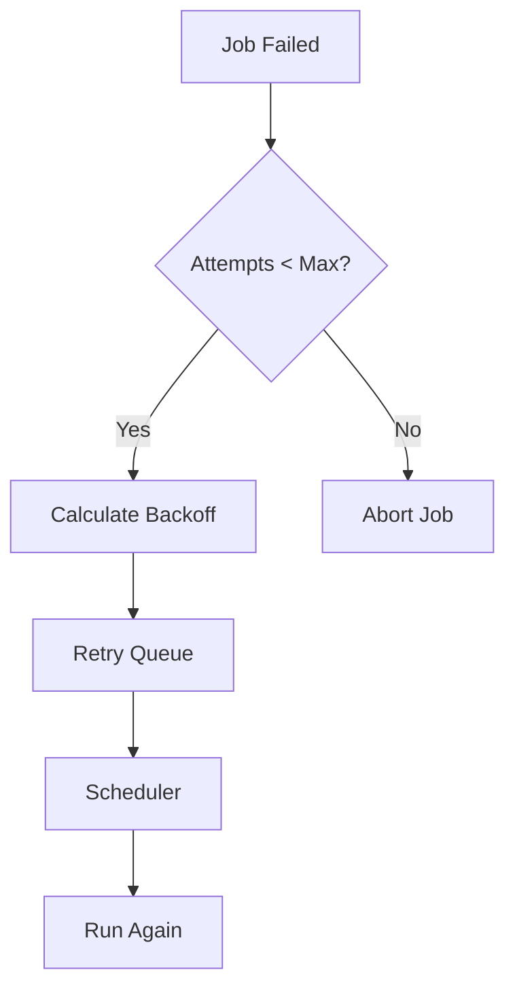

---

# 22. Agent Registration & Heartbeat

Before an agent receives work, it must register itself.

Registration includes:

- Agent ID
- Agent Type
- Version
- Maximum Concurrency
- Supported Tools

---

## Registration Flow

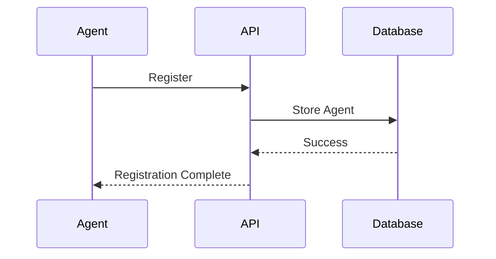

---

## Heartbeat Protocol

Every agent periodically sends:

```
agent_id

status

current_load

max_concurrency

timestamp
```

Default heartbeat interval:

```
30 seconds
```

---

## Heartbeat Sequence

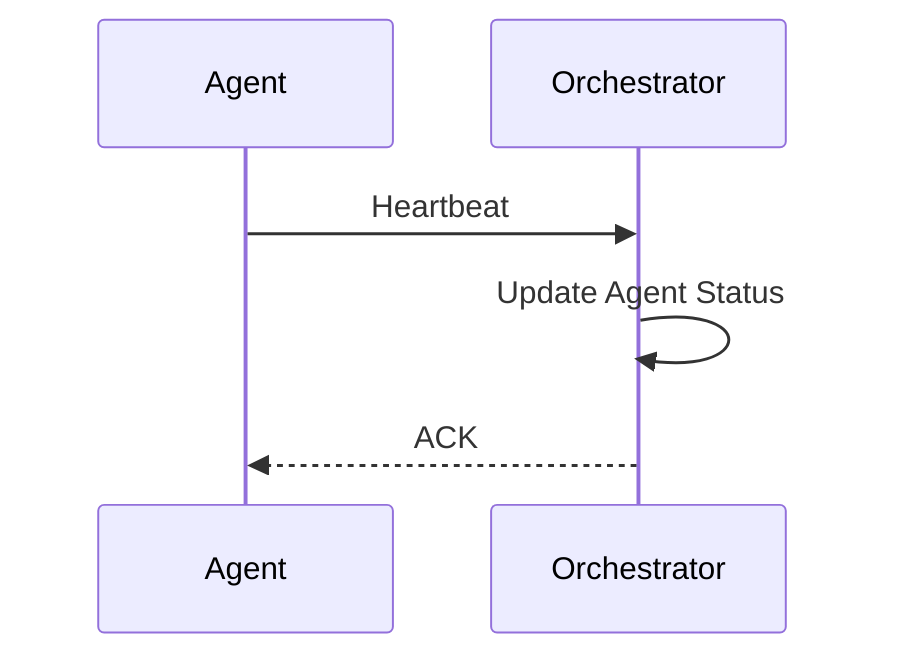

If heartbeat timeout exceeds:

```
90 seconds
```

Agent status becomes:

```
offline
```

Scheduler immediately stops assigning new jobs.

---

# 23. Job Dispatch Flow

Once an agent is selected:

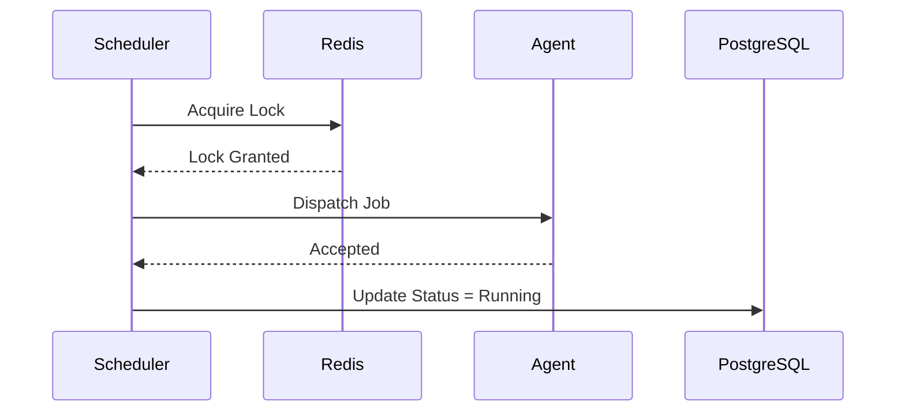

After completion:

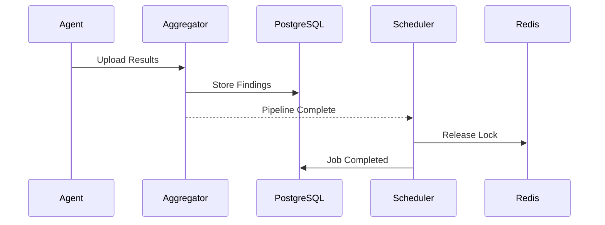

---

# 24. Complete Scan Sequence

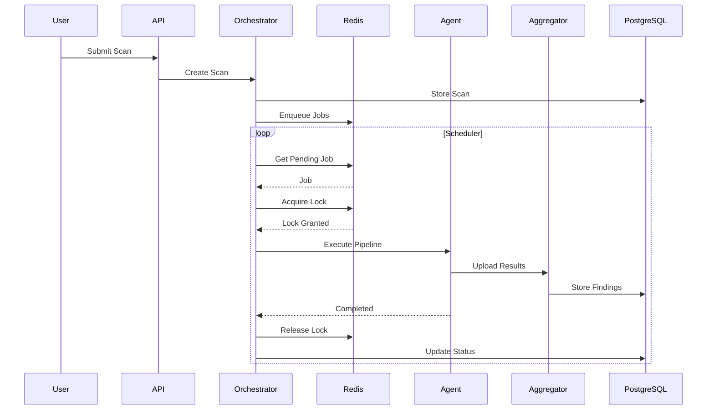

---

# 25. Redis Key Design

Redis is used for two purposes:

1. Queue Management
2. Distributed Locking

---

## Queue Keys

```
queue:pending

queue:retry

queue:running

queue:completed
```

---

## Lock Keys

```
lock:asset:<asset_id>
```

Example:

```
lock:asset:5f1a1f5d
```

---

## Agent Keys

```
agent:<agent_id>
```

Stores:

```
status

current_load

last_seen

capabilities
```

---

## Scan Keys

```
scan:<scan_id>
```

Temporary execution metadata.

---

# 26. Failure Recovery

The orchestration engine must recover automatically from unexpected failures.

---

## Agent Failure

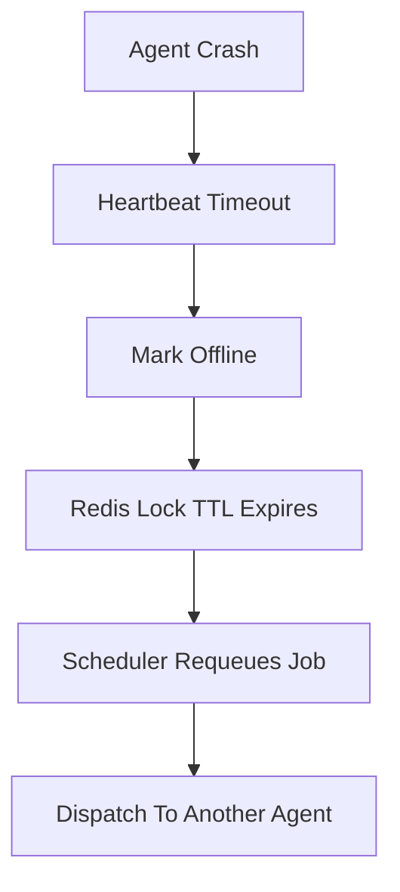

---

## Lock Expiration

Every lock has a lease.

Example:

```
7200 seconds
```

While scanning:

```
Heartbeat

↓

Renew Lease
```

If heartbeat stops:

```
Lease expires

↓

Lock removed

↓

Retry
```

---

## Scheduler Crash

Since job state is stored in PostgreSQL and Redis:

1. Restart scheduler.
2. Read pending jobs.
2. Resume scheduling.

No scan history is lost.

---

# Design Decisions

| Decision | Reason |
|-----------|--------|
| One lock per asset | Prevent duplicate scans |
| Redis queues | Fast scheduling |
| PostgreSQL | Durable storage |
| Exponential retry | Prevent resource exhaustion |
| Heartbeats | Detect failures |
| DAG execution | Respect tool dependencies |
| Separate scanner agents | Independent scalability |
| Stateless scheduler | Easy horizontal scaling |

---

# 27. Database Architecture Overview

PostgreSQL is used as the primary persistent storage layer of the vulnerability orchestration engine.

The database acts as the source of truth for:

- Users
- Organizations
- Assets
- Scanner agents
- Scan requests
- Scan execution state
- Job history
- Findings
- Reports
- Audit records

Redis is used only for temporary operational data:

- Job queues
- Distributed locks
- Agent heartbeat cache

PostgreSQL stores all information required for:

- Recovery after failures
- Compliance auditing
- Historical reporting
- Analytics

---

# 28. Database Design Principles

## 28.1 Source of Truth Principle

PostgreSQL contains the authoritative state of the system.

Example:

Redis:

```
Job currently running
```

PostgreSQL:

```
Job state = RUNNING
Started at = timestamp
Assigned agent = agent_id
```

If Redis data disappears, the system can recover from PostgreSQL.

---

# 28.2 Separation of Concerns

The database separates:

## Identity Data

Examples:

- Organizations
- Users

---

## Infrastructure Data

Examples:

- Assets
- Agents

---

## Execution Data

Examples:

- Scans
- Jobs
- Job executions

---

## Compliance Data

Examples:

- Findings
- Reports
- Disputes
- Audit logs

---

# 28.3 Immutable Execution History

The system should preserve execution history.

Instead of:

```
Job Failed

↓

Update job row
```

The system stores:

```
Job

+

Execution Attempts
```

Example:

```
Job #101

Attempt 1
FAILED

Attempt 2
FAILED

Attempt 3
SUCCESS
```

This helps debugging and compliance auditing.

---

# 29. Entity Relationship Diagram

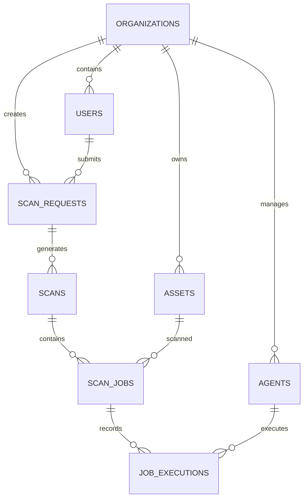

---

# 30. Organizations Table

## Purpose

Represents customers or tenants using the platform.

The platform supports multi-tenancy where each organization has isolated:

- Users
- Assets
- Scans
- Reports

---

## Schema

```sql
CREATE TABLE organizations (

    organization_id UUID PRIMARY KEY
        DEFAULT gen_random_uuid(),

    name VARCHAR(255) NOT NULL,

    description TEXT,

    status VARCHAR(50)
        DEFAULT 'active',

    created_at TIMESTAMPTZ
        DEFAULT CURRENT_TIMESTAMP,

    updated_at TIMESTAMPTZ
        DEFAULT CURRENT_TIMESTAMP
);
```

---

## Example

```
Organization

Acme Corporation

Assets:
500

Users:
20

Reports:
200
```

---

# 31. Users Table

## Purpose

Stores platform users.

Users belong to an organization.

Roles:

| Role | Permission |
|-|-|
| Admin | Full access |
| Analyst | Manage scans and findings |
| Executive | View reports |

---

## Schema

```sql
CREATE TABLE users (

    user_id UUID PRIMARY KEY
        DEFAULT gen_random_uuid(),

    organization_id UUID NOT NULL,

    email VARCHAR(255)
        UNIQUE NOT NULL,

    password_hash TEXT NOT NULL,

    role VARCHAR(50)
        NOT NULL,

    is_active BOOLEAN
        DEFAULT TRUE,

    created_at TIMESTAMPTZ
        DEFAULT CURRENT_TIMESTAMP,

    updated_at TIMESTAMPTZ
        DEFAULT CURRENT_TIMESTAMP,

    CONSTRAINT fk_user_org
    FOREIGN KEY(organization_id)
    REFERENCES organizations(organization_id)

);
```

---

## Constraints

Allowed roles:

```sql
CHECK (
role IN
(
'admin',
'analyst',
'executive'
)
)
```

---

# 32. Assets Table

## Purpose

Stores all scan targets.

Examples:

- IP addresses
- Domains
- Servers
- Applications

---

## Schema

```sql
CREATE TABLE assets (

    asset_id UUID PRIMARY KEY
        DEFAULT gen_random_uuid(),

    organization_id UUID NOT NULL,

    hostname VARCHAR(255),

    ip_address INET,

    asset_type VARCHAR(50)
        NOT NULL,

    environment VARCHAR(100),

    criticality VARCHAR(50)
        DEFAULT 'medium',

    discovered_source VARCHAR(100),

    is_active BOOLEAN
        DEFAULT TRUE,

    created_at TIMESTAMPTZ
        DEFAULT CURRENT_TIMESTAMP,

    updated_at TIMESTAMPTZ
        DEFAULT CURRENT_TIMESTAMP,

    CONSTRAINT fk_asset_org
    FOREIGN KEY(organization_id)
    REFERENCES organizations(organization_id)

);
```

---

## Asset Types

Example:

```
external

internal

web_application

database

server
```

---

## Criticality

```
low

medium

high

critical
```

Criticality affects:

- Scheduling priority
- Reporting
- Risk ranking

---

# 33. Agent Management

Scanner agents are execution workers.

Agents do not contain scheduling logic.

They only execute assigned jobs.

---

# 33.1 Agents Table

## Purpose

Stores registered scanner workers.

---

## Schema

```sql
CREATE TABLE agents (

    agent_id UUID PRIMARY KEY
        DEFAULT gen_random_uuid(),

    organization_id UUID,

    agent_name VARCHAR(255)
        NOT NULL,

    agent_type VARCHAR(50)
        NOT NULL,

    status VARCHAR(50)
        DEFAULT 'offline',

    max_concurrency INTEGER
        DEFAULT 1,

    current_load INTEGER
        DEFAULT 0,

    last_heartbeat TIMESTAMPTZ,

    created_at TIMESTAMPTZ
        DEFAULT CURRENT_TIMESTAMP

);
```

---

# Agent States

```
online

offline

draining

maintenance
```

---

# 33.2 Agent Capabilities Table

## Purpose

Stores scanner capabilities.

This avoids storing tool information as text.

Example:

Agent 1:

```
Nmap

OpenVAS
```

Agent 2:

```
Nmap

Internal Checks
```

---

## Schema

```sql
CREATE TABLE agent_capabilities (

    capability_id UUID PRIMARY KEY
        DEFAULT gen_random_uuid(),

    agent_id UUID NOT NULL,

    capability_name VARCHAR(100)
        NOT NULL,

    version VARCHAR(50),

    FOREIGN KEY(agent_id)
    REFERENCES agents(agent_id)

);
```

---

# 34. Scan Request Model

A scan request represents user intent.

Example:

User:

```
Scan all external assets
```

The orchestrator converts this request into an execution.

---

# Scan Requests Table

```sql
CREATE TABLE scan_requests (

    request_id UUID PRIMARY KEY
        DEFAULT gen_random_uuid(),

    organization_id UUID NOT NULL,

    requested_by UUID NOT NULL,

    scan_type VARCHAR(50)
        NOT NULL,

    requested_at TIMESTAMPTZ
        DEFAULT CURRENT_TIMESTAMP,

    status VARCHAR(50)
        DEFAULT 'pending',

    FOREIGN KEY(organization_id)
    REFERENCES organizations(organization_id),

    FOREIGN KEY(requested_by)
    REFERENCES users(user_id)

);
```

---

# Scan Request States

```
pending

approved

scheduled

completed

cancelled
```

---

# 35. Scan Execution Model

A scan request can generate one or more scan executions.

Example:

Quarterly scan:

```
Request

↓

Q1 Scan

Q2 Scan

Q3 Scan

Q4 Scan
```

---

# Scans Table

```sql
CREATE TABLE scans (

    scan_id UUID PRIMARY KEY
        DEFAULT gen_random_uuid(),

    request_id UUID NOT NULL,

    started_at TIMESTAMPTZ,

    completed_at TIMESTAMPTZ,

    status VARCHAR(50)
        DEFAULT 'created',

    overall_result VARCHAR(50),

    created_at TIMESTAMPTZ
        DEFAULT CURRENT_TIMESTAMP,

    FOREIGN KEY(request_id)
    REFERENCES scan_requests(request_id)

);
```

---

# Scan States

```
created

running

completed

failed

partial
```

---

# 36. Job Management

A scan is divided into jobs.

Example:

Scan:

```
100 Assets
```

creates:

```
100 Scan Jobs
```

Each job owns one asset pipeline.

---

# Scan Jobs Table

```sql
CREATE TABLE scan_jobs (

    job_id UUID PRIMARY KEY
        DEFAULT gen_random_uuid(),

    scan_id UUID NOT NULL,

    asset_id UUID NOT NULL,

    current_stage VARCHAR(100),

    status VARCHAR(50)
        DEFAULT 'pending',

    priority INTEGER
        DEFAULT 5,

    assigned_agent UUID,

    created_at TIMESTAMPTZ
        DEFAULT CURRENT_TIMESTAMP,

    FOREIGN KEY(scan_id)
    REFERENCES scans(scan_id),

    FOREIGN KEY(asset_id)
    REFERENCES assets(asset_id),

    FOREIGN KEY(assigned_agent)
    REFERENCES agents(agent_id)

);
```

---

# Job Priority

Higher priority jobs execute first.

Example:

```
Critical Asset

Priority = 1

Normal Asset

Priority = 5
```

---

# 37. Job Execution History

## Purpose

Stores every execution attempt.

A job can have multiple attempts.

---

## Schema

```sql
CREATE TABLE job_executions (

    execution_id UUID PRIMARY KEY
        DEFAULT gen_random_uuid(),

    job_id UUID NOT NULL,

    agent_id UUID NOT NULL,

    attempt_number INTEGER,

    started_at TIMESTAMPTZ,

    completed_at TIMESTAMPTZ,

    status VARCHAR(50),

    error_message TEXT,

    FOREIGN KEY(job_id)
    REFERENCES scan_jobs(job_id),

    FOREIGN KEY(agent_id)
    REFERENCES agents(agent_id)

);
```

---

# 38. Database Relationships

## Organization

```
Organization

1

|

Many

Users
Assets
Agents
Scans
```

---

## Scan

```
Scan

1

|

Many

Jobs
```

---

## Job

```
Job

1

|

Many

Execution Attempts
```

---

# 39. Indexing Strategy

Indexes are required because the scheduler performs frequent queries.

---

## Asset Lookup

```sql
CREATE INDEX idx_assets_org
ON assets(organization_id);
```

---

## Pending Jobs

Scheduler frequently searches pending jobs.

```sql
CREATE INDEX idx_jobs_status
ON scan_jobs(status);
```

---

## Agent Availability

```sql
CREATE INDEX idx_agents_status
ON agents(status);
```

---

## Heartbeat Monitoring

```sql
CREATE INDEX idx_agent_heartbeat
ON agents(last_heartbeat);
```

---

## Scan History

```sql
CREATE INDEX idx_scan_request
ON scans(request_id);
```

---

# 40. Findings Management

## Purpose

The Findings database stores normalized vulnerabilities discovered by different scanner tools.

Scanner agents produce different output formats:

Example:

```
Nmap
    |
    XML

OpenVAS
    |
    XML

Python Plugins
    |
    JSON
```

The Findings Aggregator converts all outputs into a common database format.

The database should not depend on any specific scanner.

---

# Findings Data Flow

```mermaid
flowchart LR

A[Nmap Output]
B[OpenVAS Output]
C[testssl Output]
D[Python Plugin Output]

A --> E[Findings Aggregator]
B --> E
C --> E
D --> E

E --> F[Normalized Finding]
F --> G[(PostgreSQL)]
```

---

# 41. Vulnerability Normalization Model

Every vulnerability is stored using a common structure.

Example:

```
Finding:

Title:
SQL Injection

Source:
Nmap / OpenVAS

CVE:
CVE-2024-XXXX

Severity:
High

CVSS:
8.8

Asset:
web-server-01

Port:
443
```

---

# Findings Table

```sql
CREATE TABLE findings (

    finding_id UUID PRIMARY KEY
        DEFAULT gen_random_uuid(),

    scan_id UUID NOT NULL,

    asset_id UUID NOT NULL,

    source_tool VARCHAR(100)
        NOT NULL,

    vulnerability_id VARCHAR(255),

    title TEXT NOT NULL,

    description TEXT,

    recommendation TEXT,

    severity VARCHAR(50),

    cvss_score DECIMAL(3,1),

    cvss_source VARCHAR(50),

    port INTEGER,

    service VARCHAR(100),

    evidence TEXT,

    status VARCHAR(50)
        DEFAULT 'open',

    is_auto_fail BOOLEAN
        DEFAULT FALSE,

    first_seen TIMESTAMPTZ
        DEFAULT CURRENT_TIMESTAMP,

    last_seen TIMESTAMPTZ
        DEFAULT CURRENT_TIMESTAMP,

    FOREIGN KEY(scan_id)
    REFERENCES scans(scan_id),

    FOREIGN KEY(asset_id)
    REFERENCES assets(asset_id)

);
```

---

# Finding Status

A finding can move through:

```
open

↓

disputed

↓

approved exception

OR

↓

fixed

↓

closed
```

---

# 42. CVSS Scoring Model

The system separates:

- Vulnerability discovery
- Risk calculation
- Compliance decision

The scanner only provides raw vulnerability information.

The engine calculates final scoring.

---

# CVSS Source

The source of CVSS information is tracked.

Example:

```
Primary:

NVD Database

Fallback:

OpenVAS Database
```

---

## CVSS Fields

| Field | Purpose |
|-|-|
| cvss_score | Numerical severity |
| cvss_source | Origin of score |
| vulnerability_id | CVE identifier |

---

Example:

```
CVE-2025-1234

CVSS:
9.8

Source:
NVD
```

---

# 43. PCI Automatic Failure Rules

Some vulnerabilities automatically fail compliance regardless of CVSS score.

Example:

```
CVSS 5.0

SQL Injection

Result:

FAIL
```

---

# Automatic Failure Examples

The rule engine marks:

```text
is_auto_fail = true
```

for:

- SQL Injection
- Cross Site Scripting
- Directory Traversal
- Default Credentials
- Exposed Databases
- DNS Zone Transfer
- Unsupported Operating Systems
- Weak SSL/TLS configurations

---

# Rule Engine Flow

```mermaid
flowchart TD

A[Finding Created]

A --> B[Check CVSS]
B --> C[Check PCI Rules]
C --> D{Automatic Failure?}
D -->|Yes| E[Mark FAIL]
D -->|No| F[Normal Evaluation]
```

---

# 44. Remediation Engine

## Purpose

The platform does not stop at reporting a vulnerability.

Every finding must carry a resolved fix before it reaches the customer.

This is a control-plane data step, not a scan job.

It runs synchronously, immediately after the PCI Rule Engine (§43) and before the finding is persisted.

It never touches the scheduler, the agent dispatcher, or the lock manager.

---

## Two Resolution Paths

Findings resolve their remediation in one of two ways, depending on origin.

---

### Path 1: Rule-Based Findings

Applies to config/exposure checks.

Example:

```
Missing HSTS

SMBv1 Enabled

Weak Cipher Suite

Default Credentials

DNS Zone Transfer
```

These map by exact match on:

```
findings.rule_key → remediation_templates.rule_key
```

The template text is rendered with the specific instance details (port, service, host) from that finding.

---

### Path 2: CVE-Based Findings

Applies to findings sourced from OpenVAS / NVD.

Resolution order:

```
1. NVD reference / patch link for the CVE

2. Fallback: generic template keyed by CWE category

2. Fallback: generic severity-based statement
```

---

## Coverage

The MVP's check list (§3, §43) is a bounded set — roughly 10 categories.

This means Path 1 only needs a fixed, curated template table, written once.

Path 2 does not require manual curation — it piggybacks on NVD's own reference data, which already grows with the CVE database.

---

## Remediation Templates Table

```sql
CREATE TABLE remediation_templates (

    template_id UUID PRIMARY KEY
        DEFAULT gen_random_uuid(),

    rule_key VARCHAR(100)
        NOT NULL UNIQUE,

    title TEXT NOT NULL,

    remediation_text TEXT
        NOT NULL,

    severity_context VARCHAR(50),

    reference_links JSONB,

    created_at TIMESTAMPTZ
        DEFAULT CURRENT_TIMESTAMP

);
```

---

### Example Row

```
rule_key:
smb_v1_enabled

title:
SMBv1 Protocol Enabled

remediation_text:
Disable SMBv1 on {host} via Windows Features or registry key
LanmanServer\\Parameters\\SMB1. Confirm no legacy clients require it
before disabling.

severity_context:
high

reference_links:
["https://learn.microsoft.com/... smbv1-deprecation"]
```

---

## Findings Table Extension

Extends the `findings` table defined in §41.

```sql
ALTER TABLE findings

    ADD COLUMN rule_key VARCHAR(100),

    ADD COLUMN remediation_id UUID,

    ADD CONSTRAINT fk_remediation_template

        FOREIGN KEY(remediation_id)

        REFERENCES remediation_templates(template_id);
```

`rule_key` is set by the PCI Rule Engine (§43) at the same time `is_auto_fail` is evaluated.

`remediation_id` is set by the Remediation Engine described here, and is nullable — pure CVE findings resolved through NVD may not use a template row at all.

`findings.recommendation` (already defined in §41) becomes the final, already-rendered output of this step. It is never computed at report-render time.

---

## Extended Rule Engine Flow

Extends the Rule Engine Flow diagram in §43.

```mermaid
flowchart TD

A[Finding Created]

A --> B[Check CVSS]
B --> C[Check PCI Rules]
C --> D{Automatic Failure?}
D -->|Yes| E[Mark FAIL]
D -->|No| F[Normal Evaluation]

E --> G[Remediation Mapper]
F --> G

G --> H{Rule-Based Finding?}
H -->|Yes| I[Match rule_key to Template]
H -->|No| J[Resolve via NVD Reference]

J --> K{Reference Available?}
K -->|No| L[CWE Fallback Template]

I --> M[Render recommendation]
L --> M
K -->|Yes| M

M --> N[(Store Finding)]
```

---

## Remediation Resolution Sequence

```mermaid
sequenceDiagram

participant RuleEngine
participant RemediationMapper
participant TemplateTable
participant NVD
participant Database

RuleEngine->>RemediationMapper: Finding + rule_key / CVE

alt Rule-Based

RemediationMapper->>TemplateTable: Lookup rule_key
TemplateTable-->>RemediationMapper: Template Text

else CVE-Based

RemediationMapper->>NVD: Lookup CVE Reference
NVD-->>RemediationMapper: Patch Link or None

end

RemediationMapper->>RemediationMapper: Render Final Text
RemediationMapper->>Database: Store recommendation
```

---

## Design Decisions

Same stage placement as CVSS scoring (§42) — Keeps discovery, scoring, and remediation as three explicit, auditable stages, not implicit report-time logic.

---

# 46. ASV Operational Workflow

The ASV operational workflow belongs after the platform's findings normalization, PCI evaluation, and remediation stages because it describes how technical scan output becomes an analyst-reviewed compliance outcome. It connects the control-plane processing model to the human governance steps required for Approved Scanning Vendor operations.

This section defines how customer scope, automated discovery, scan execution, finding enrichment, analyst review, dispute handling, and final report publication work together inside the broader architecture.

---

## 46.1 Workflow Position in the Platform

The workflow begins once the platform has the ability to manage assets, execute scanner jobs, normalize findings, apply PCI decision logic, and generate remediation guidance. At that point, the ASV process explains how those capabilities are used operationally by customers, the platform, and authorized ASV analysts.

In practice, this section bridges the technical pipeline and the governance pipeline:

```mermaid
flowchart LR

A[Asset Scope] --> B[Scan Execution]
B --> C[Findings Normalization]
C --> D[PCI Evaluation]
D --> E[Remediation Enrichment]
E --> F[Draft Report]
F --> G[ASV Analyst Review]
G --> H[Dispute Handling]
H --> I[Final PCI Report]
```

---

## 46.2 End-to-End Operational Flow

```mermaid
flowchart TD

A[Customer Administrator]
A --> B[Define Scan Scope]
B --> C[Asset Inventory]
C --> D[Discovery and Scope Validation]
D --> E{Additional Assets Found?}
E -->|Yes| F[Customer Review]
F --> C
E -->|No| G[Create Scan Request]
G --> H[Scheduler]
H --> I[Scanner Agent]
I --> J[Nmap / OpenVAS / Nuclei / Plugins]
J --> K[Findings Aggregator]
K --> L[Risk and Compliance Engine]
L --> M[Remediation Engine]
M --> N[Draft Report]
N --> O[ASV Security Analyst Review]
O -->|Approved| P[Final PCI Report]
O -->|Requires Investigation| Q[Customer Dispute / Evidence]
Q --> O
P --> R[Customer Dashboard]
```

---

## 46.3 Workflow Description

### Step 1 - Scan Scope Definition

The process begins when the **Customer Administrator** defines the Internet-facing assessment scope. This includes IP addresses, CIDR ranges, FQDNs, public web applications, and external services.

The customer remains responsible for making sure all systems connected to the Cardholder Data Environment are represented in scope.

---

### Step 2 - Asset Discovery and Scope Validation

After the customer provides the starting scope, the platform performs automated discovery to identify additional Internet-facing assets that may have been omitted. Discovery may include DNS lookups, subdomain enumeration, service discovery, web crawling, and network enumeration.

If the platform finds additional assets, the customer must confirm them before they are added to the final assessment scope.

---

### Step 3 - Scan Execution

Once scope is finalized, the scheduler creates jobs and assigns them to available scanner agents. Each asset executes the defined pipeline using Nmap, OpenVAS, Nuclei, TLS analysis, and custom plugins.

The scanner agent uploads raw outputs back to the control plane for normalization and downstream compliance processing.

---

### Step 4 - Findings Aggregation

Raw scanner outputs are transformed into a normalized findings model. The Findings Aggregator extracts the vulnerability title, CVE identifier when available, CVSS score, severity, affected service, evidence, and scanner source.

This ensures that the rest of the platform works from one consistent representation regardless of the originating scanner.

---

### Step 5 - Risk and Compliance Evaluation

The Rule Engine evaluates normalized findings against PCI DSS logic. It determines risk severity, automatic failure conditions, compliance impact, and final finding status.

Policy-based issues such as weak TLS settings or default credentials are also evaluated even when no CVE is present.

---

### Step 6 - Remediation Recommendation

The Remediation Engine enriches each finding with corrective guidance. Recommendations may come from rule-based templates, CVE-linked vendor or NVD references, or generic fallback guidance where no specific remediation is available.

The platform provides remediation instructions but does not automatically modify customer systems.

---

### Step 7 - Draft Report and ASV Analyst Review

After technical processing completes, the platform generates a draft report. Only an **Authorized ASV Security Analyst** may review findings, evaluate false positives, assess customer-submitted evidence, process disputes, approve compliance decisions, and issue the final PCI report.

Customers cannot directly change findings, severity ratings, or compliance outcomes.

---

### Step 8 - Report Publication

After analyst approval, the platform publishes the final compliance report. The report may include an executive summary, asset inventory, vulnerability summary, detailed findings, remediation recommendations, compliance status, and audit information.

Reports are retained according to policy and exposed through the customer dashboard.

---

## 46.4 Responsibility Matrix

| Activity | Customer Administrator | ASV Security Analyst | Platform |
|---|---|---|---|
| Define scan scope | ✓ | Assist |  |
| Discover additional assets |  |  | ✓ |
| Execute scans |  |  | ✓ |
| Normalize findings |  |  | ✓ |
| Evaluate PCI rules |  |  | ✓ |
| Generate remediation recommendations |  |  | ✓ |
| Submit dispute | ✓ |  |  |
| Review disputes |  | ✓ |  |
| Modify findings | ✗ | ✓ |  |
| Approve reports | ✗ | ✓ |  |
| View executive reports | ✓ | ✓ |  |

---

## 46.5 Design Principles

The operational workflow is designed to preserve the separation of responsibilities required for PCI DSS Approved Scanning Vendor operations. Customers define scope and review outcomes, scanner agents perform discovery work, the control plane performs technical correlation and compliance evaluation, and only authorized ASV analysts can finalize report decisions.

All report modifications, dispute resolutions, and compliance decisions should be preserved in immutable audit records so the platform can support traceability, governance, and regulatory review.

---
# 46. Dispute and Exception Workflow

Customers may challenge findings.

Examples:

- False positive
- Compensating control exists

The dispute workflow tracks this process.

---

# Disputes Table

```sql
CREATE TABLE disputes (

    dispute_id UUID PRIMARY KEY
        DEFAULT gen_random_uuid(),

    finding_id UUID NOT NULL,

    submitted_by UUID NOT NULL,

    dispute_type VARCHAR(50),

    evidence_text TEXT,

    evidence_file_url TEXT,

    reviewed_by UUID,

    decision VARCHAR(50)
        DEFAULT 'pending',

    decision_notes TEXT,

    created_at TIMESTAMPTZ
        DEFAULT CURRENT_TIMESTAMP,

    resolved_at TIMESTAMPTZ,

    FOREIGN KEY(finding_id)
    REFERENCES findings(finding_id)

);
```

---

# Dispute Types

```
false_positive

compensating_control
```

---

# Decision States

```
pending

approved

rejected
```

---

# Dispute Flow

```mermaid
flowchart TD

A[Finding]

A --> B[Customer Dispute]
B --> C[Security Analyst Review]
C --> D{Decision}
D -->|Approved| E[Exception Granted]
D -->|Rejected| F[Finding Remains Open]
```

---

# 47. Report Management

Reports are generated after scan completion.

The report engine reads:

```
Scan Data

+

Assets

+

Findings

+

Disputes

↓

Report
```

---

# Reports Table

```sql
CREATE TABLE reports (

    report_id UUID PRIMARY KEY
        DEFAULT gen_random_uuid(),

    scan_id UUID NOT NULL,

    report_type VARCHAR(100),

    format VARCHAR(20),

    storage_location TEXT,

    generated_at TIMESTAMPTZ
        DEFAULT CURRENT_TIMESTAMP,

    retention_until TIMESTAMPTZ NOT NULL,

    overall_result VARCHAR(50),

    FOREIGN KEY(scan_id)
    REFERENCES scans(scan_id)

);
```

---

# Report Types

```
attestation

summary

vulnerability_detail
```

---

# Report Formats

```
PDF

CSV
```

---

# 48. Report Storage Architecture

Reports should not be stored directly inside PostgreSQL.

Instead:

```
PostgreSQL

Stores:

Metadata
Location
Retention Date

Object Storage

Stores:

PDF
CSV
Evidence Files
```

---

# Storage Flow

```mermaid
flowchart LR

A[Scan Completed]

A --> B[Generate Report]
B --> C[Upload PDF/CSV]
C --> D[S3 / MinIO]
D --> E[Save Metadata]
E --> F[(PostgreSQL)]
```

---

# 49. Three-Year Retention Policy

Compliance reports must remain available for:

```
3 Years
```

---

# Retention Example

Generated:

```
2026-07-13
```

Retention:

```
2029-07-13
```

Database:

```text
generated_at:

2026-07-13

retention_until:

2029-07-13
```

---

# Retention Cleanup Job

A background worker periodically checks:

```sql
SELECT *
FROM reports
WHERE retention_until < NOW();
```

Actions:

```
Archive

OR

Delete according to policy
```

---

# 50. Quarterly Scan Scheduling

PCI compliance requires recurring scans.

The scheduler supports:

- Quarterly scans
- Monthly scans
- Weekly scans
- Custom schedules

---

# Scan Schedule Table

```sql
CREATE TABLE scan_schedules (

    schedule_id UUID PRIMARY KEY
        DEFAULT gen_random_uuid(),

    organization_id UUID NOT NULL,

    scan_type VARCHAR(50),

    frequency VARCHAR(50),

    next_run TIMESTAMPTZ,

    last_run TIMESTAMPTZ,

    enabled BOOLEAN
        DEFAULT TRUE,

    created_at TIMESTAMPTZ
        DEFAULT CURRENT_TIMESTAMP,

    FOREIGN KEY(organization_id)
    REFERENCES organizations(organization_id)

);
```

---

# Scheduling Flow

```mermaid
flowchart TD

A[Scheduler Service]

A --> B[Check scan_schedules]
B --> C{Due?}
C -->|Yes| D[Create Scan Request]
D --> E[Create Scan]
E --> F[Execute Pipeline]
C -->|No| G[Wait]
```

---

# Example

Schedule:

```
Organization:

Acme Corp

Frequency:

Quarterly
```

Execution:

```
January

April

July

October
```

---

# 51. Audit Logging

All important actions must be recorded.

Examples:

- User login
- Scan creation
- Job dispatch
- Report generation
- Finding changes

---

# Audit Log Table

```sql
CREATE TABLE audit_logs (

    audit_id UUID PRIMARY KEY
        DEFAULT gen_random_uuid(),

    organization_id UUID,

    user_id UUID,

    action VARCHAR(100),

    entity_type VARCHAR(100),

    entity_id UUID,

    details JSONB,

    created_at TIMESTAMPTZ
        DEFAULT CURRENT_TIMESTAMP

);
```

---

# Example Audit Record

```json
{
 "action": "SCAN_CREATED",
 "entity": "scan",
 "user": "admin@example.com"
}
```

---

# 52. Scheduler Event Tracking

The scheduler itself requires observability.

Events include:

- Job assigned
- Lock acquired
- Lock released
- Retry scheduled
- Agent unavailable

---

# Scheduler Events Table

```sql
CREATE TABLE scheduler_events (

    event_id UUID PRIMARY KEY
        DEFAULT gen_random_uuid(),

    job_id UUID,

    event_type VARCHAR(100),

    message TEXT,

    metadata JSONB,

    created_at TIMESTAMPTZ
        DEFAULT CURRENT_TIMESTAMP

);
```

---

# Example Events

```
JOB_CREATED

LOCK_ACQUIRED

AGENT_SELECTED

JOB_FAILED

RETRY_SCHEDULED

LOCK_RELEASED
```

---

# 53. Final Database Relationship Diagram

```mermaid
erDiagram

ORGANIZATIONS {
UUID organization_id
string name
}

USERS {
UUID user_id
string email
}

ASSETS {
UUID asset_id
string hostname
}

AGENTS {
UUID agent_id
string status
}

SCAN_REQUESTS {
UUID request_id
string scan_type
}

SCANS {
UUID scan_id
string status
}

SCAN_JOBS {
UUID job_id
string status
}

JOB_EXECUTIONS {
UUID execution_id
integer attempt
}

FINDINGS {
UUID finding_id
string severity
}

DISPUTES {
UUID dispute_id
string decision
}

REPORTS {
UUID report_id
string format
}

SCAN_SCHEDULES {
UUID schedule_id
string frequency
}

AUDIT_LOGS {
UUID audit_id
string action
}

ORGANIZATIONS ||--o{ USERS : owns
ORGANIZATIONS ||--o{ ASSETS : owns
ORGANIZATIONS ||--o{ AGENTS : manages
ORGANIZATIONS ||--o{ SCAN_REQUESTS : creates

USERS ||--o{ SCAN_REQUESTS : submits

SCAN_REQUESTS ||--o{ SCANS : generates

SCANS ||--o{ SCAN_JOBS : contains

SCAN_JOBS ||--o{ JOB_EXECUTIONS : records

ASSETS ||--o{ SCAN_JOBS : targets

SCANS ||--o{ FINDINGS : produces

FINDINGS ||--o{ DISPUTES : receives

SCANS ||--o{ REPORTS : generates

ORGANIZATIONS ||--o{ SCAN_SCHEDULES : owns
```

---

# 54. Database Design Summary

The database design provides:

## Scalability

- Multi-tenant architecture
- Independent asset management
- Distributed agent support

---

## Reliability

- Persistent job state
- Execution history
- Recovery after failures

---

## Compliance

- Three-year report retention
- Audit logging
- Finding dispute workflow

---

## Scheduling Support

- Quarterly scans
- Recurring execution
- Priority-based jobs

---

## Security

- Role-based users
- Tenant isolation
- Complete activity tracking

---

# 55. API Architecture

The API layer is the entry point into the orchestration engine.

The API does not execute scans directly.

Its responsibility is:

- Authenticate users
- Validate requests
- Create scan workflows
- Retrieve scan status
- Provide reports

The actual execution is handled asynchronously by the orchestrator.

---

# API Request Flow

```mermaid
flowchart LR

A[User]

A --> B[REST API]
B --> C[Authentication]
C --> D[Request Validation]
D --> E[Create Scan Request]
E --> F[Orchestrator]
F --> G[Scheduler]
G --> H[Scanner Agents]
```

---

# API Technology

Recommended stack:

| Component | Technology |
|-|-|
| Framework | FastAPI |
| Authentication | JWT |
| Documentation | OpenAPI / Swagger |
| Validation | Pydantic |
| Communication | HTTPS |

---

# 56. REST API Design

The API follows REST principles.

Base URL:

```
/api/v1
```

---

# 56.1 Authentication APIs

## Login

```
POST /api/v1/auth/login
```

Request:

```json
{
    "email":"admin@example.com",
    "password":"password"
}
```

Response:

```json
{
    "access_token":"jwt-token",
    "expires_in":3600
}
```

---

# 56.2 User APIs

## Get Current User

```
GET /api/v1/users/me
```

Response:

```json
{
    "user_id":"123",
    "role":"admin",
    "organization":"Acme"
}
```

---

# 56.3 Asset APIs

## Register Asset

```
POST /api/v1/assets
```

Example:

```json
{
 "hostname":"server01.company.com",
 "ip_address":"10.0.0.10",
 "type":"internal"
}
```

---

## List Assets

```
GET /api/v1/assets
```

---

# 56.4 Scan APIs

## Create Scan Request

```
POST /api/v1/scans
```

Example:

```json
{
"type":"external_pci",
"assets":[
"asset-id-1",
"asset-id-2"
]
}
```

Response:

```json
{
"scan_id":"abc123",
"status":"pending"
}
```

---

## Get Scan Status

```
GET /api/v1/scans/{scan_id}
```

Response:

```json
{
"status":"running",
"progress":60
}
```

---

## Cancel Scan

```
POST /api/v1/scans/{scan_id}/cancel
```

---

# 56.5 Report APIs

## List Reports

```
GET /api/v1/reports
```

---

## Download Report

```
GET /api/v1/reports/{report_id}
```

Returns:

```
PDF / CSV
```

---

# 57. Authentication and Authorization

The platform uses JWT-based authentication.

---

# Authentication Flow

```mermaid
sequenceDiagram

participant User
participant API
participant Auth
participant Database

User->>API: Login
API->>Auth: Validate Credentials
Auth->>Database: Check User
Database-->>Auth: User Data
Auth-->>API: Generate JWT
API-->>User: Access Token
```

---

# JWT Payload Example

```json
{
"user_id":"123",
"organization_id":"456",
"role":"admin",
"expiry":"timestamp"
}
```

---

# Authorization Model

Role-based access control.

---

## Admin

Can:

- Manage users
- Create scans
- View reports
- Manage assets

---

## Analyst

Can:

- Execute scans
- Review findings
- Handle disputes

---

## Executive

Can:

- View reports
- View compliance status

---

# 58. Scan Management APIs

The scan API follows an asynchronous model.

The user does not wait for scanning completion.

Example:

```
User

↓

POST /scans

↓

Scan Created

↓

Return scan_id

↓

Background execution

↓

Report Available
```

---

# Scan Lifecycle

```mermaid
stateDiagram-v2

[*] --> Created
Created --> Scheduled
Scheduled --> Running
Running --> Completed
Running --> Failed
Failed --> Retry
Retry --> Running
Completed --> Report_Generated
```

---

# 59. Agent Communication Protocol

Scanner agents communicate with the orchestrator.

Communication model:

```
Pull Based Architecture
```

Agents periodically ask:

```
"Do I have work?"
```

Advantages:

- Firewall friendly
- Easier scaling
- No inbound connections required

---

# Agent Flow

```mermaid
sequenceDiagram

participant Agent
participant Orchestrator

Agent->>Orchestrator: Heartbeat
Orchestrator-->>Agent: Status OK

Agent->>Orchestrator: Request Job

Orchestrator->>Agent: Assign Job

Agent->>Agent: Execute Scan

Agent->>Orchestrator: Upload Result
```

---

# 60. Agent Execution Contract

Every scanner agent follows a standard interface.

---

# Job Assignment Payload

Example:

```json
{
"job_id":"123",

"asset":
{
"hostname":"example.com",
"ip":"1.2.3.4"
},

"pipeline":
[
"nmap",
"openvas"
],

"timeout":7200
}
```

---

# Agent Response

```json
{
"job_id":"123",

"status":"accepted",

"agent_id":"agent01"
}
```

---

# 61. Result Upload Protocol

Agents do not directly write into PostgreSQL.

Instead:

```
Agent

↓

Result API

↓

Aggregator

↓

Database
```

---

# Result Upload

Endpoint:

```
POST /api/v1/jobs/{job_id}/results
```

---

Example:

```json
{
"tool":"nmap",

"format":"xml",

"location":
"s3://scan-results/output.xml"
}
```

---

# Aggregation Flow

```mermaid
flowchart LR

A[Scanner Agent]

A --> B[Result Storage]
B --> C[Aggregator]
C --> D[Normalization]
D --> E[(PostgreSQL Findings)]
```

---

# 62. Security Architecture

Security is applied at every layer.

---

# 62.1 API Security

Implemented controls:

- HTTPS only
- JWT authentication
- Rate limiting
- Input validation
- Request logging

---

# 62.2 Database Security

Controls:

- Encrypted connections
- Least privilege users
- Database backups
- Tenant isolation

---

# 62.3 Agent Security

Agents communicate using:

- Mutual authentication
- API keys/certificates
- Encrypted channels

---

# Security Architecture Diagram

```mermaid
flowchart TD

A[User]

A -->|HTTPS| B[API Gateway]
B --> C[JWT Validation]
C --> D[Orchestrator]
D --> E[Encrypted Agent Channel]
E --> F[Scanner Agent]
```

---

# 63. Deployment Architecture

The platform is designed using containerized services.

---

# Deployment Diagram

```mermaid
flowchart TB

subgraph Control_Plane[Control Plane]

API[API Service]
ORCH[Orchestrator]
SCHED[Scheduler]
REPORT[Report Engine]

end

subgraph Storage

DB[(PostgreSQL)]
REDIS[(Redis)]
OBJ[S3 / MinIO]

end

subgraph Scanner_Plane[Scanner Plane]

AGENT1[Scanner Agent 1]
AGENT2[Scanner Agent 2]
AGENT3[Scanner Agent N]

end

API --> ORCH
ORCH --> SCHED
ORCH --> DB
ORCH --> REDIS

REPORT --> DB
REPORT --> OBJ

SCHED --> AGENT1
SCHED --> AGENT2
SCHED --> AGENT3
```

---

# 64. Container Architecture

Recommended deployment:

```
Docker

+

Kubernetes
```

---

Containers:

```
api-container

orchestrator-container

scheduler-container

postgres-container

redis-container

report-container

scanner-agent-container
```

---

# 65. Scaling Strategy

The system supports horizontal scaling.

---

# API Scaling

Multiple API instances:

```
API 1

API 2

API 3
```

behind load balancer.

---

# Scheduler Scaling

Multiple schedulers can run.

A leader election mechanism prevents duplicate scheduling.

Example:

```
Scheduler A

Leader

Scheduler B

Standby
```

---

# Agent Scaling

Add more agents:

```
Agent 1

Agent 2

Agent 3

Agent N
```

Scheduler automatically distributes jobs.

---

# Scaling Diagram

```mermaid
flowchart LR

LB[Load Balancer]

LB --> API1[API Instance 1]
LB --> API2[API Instance 2]
LB --> API3[API Instance 3]

API1 --> ORCH
API2 --> ORCH
API3 --> ORCH

ORCH --> AGENTS
```

---

# 66. High Availability Design

The system avoids single points of failure.

---

## Component Failure Handling

| Component | Recovery |
|-|-|
| API | Restart container |
| Scheduler | Leader election |
| Agent | Job retry |
| Redis | Persistence |
| Database | Backup restore |
| Report Engine | Queue retry |

---

# Database Backup Strategy

Recommended:

Daily:

```
Full backup
```

Hourly:

```
Incremental backup
```

Retention:

```
3 years
```

---

# 67. Monitoring and Observability

The system requires monitoring of:

- Jobs
- Agents
- Scheduler
- Database
- API latency

---

# Metrics

Examples:

```
active_jobs

failed_jobs

agent_health

queue_size

scan_duration

lock_wait_time
```

---

# Monitoring Architecture

```mermaid
flowchart LR

A[Services]

A --> B[Metrics Collector]
B --> C[Monitoring Dashboard]
A --> D[Logs]
D --> E[Log Storage]
```

---

# 68. Logging Architecture

Logs are structured JSON.

Example:

```json
{
"time":"2026-01-01",

"service":"scheduler",

"event":"JOB_ASSIGNED",

"job_id":"123"
}
```

---

# Log Types

## Application Logs

API errors

---

## Scheduler Logs

Job decisions

---

## Security Logs

Authentication events

---

## Audit Logs

User activity

---

# 69. Future Improvements

## 69.1 Machine Learning Risk Prioritization

Automatically prioritize vulnerabilities based on:

- Asset importance
- Exposure
- Exploit availability

---

## 69.2 Event Driven Architecture

Replace polling with:

```
Kafka

or

RabbitMQ
```

for large deployments.

---

## 69.3 Dynamic Agent Scaling

Automatically create scanner agents based on workload.

---

## 69.4 Real-Time Dashboard

Add:

- Live scan progress
- Agent status
- Vulnerability trends

---

## 69.5 Multi-Cloud Deployment

Support:

- AWS
- Azure
- Google Cloud

scanner agents.

---

# Final Architecture Summary

The proposed system consists of:

## Control Plane

Responsible for:

- Scheduling
- Lock management
- Job orchestration
- Reports

## Scanner Plane

Responsible for:

- Vulnerability discovery
- Tool execution
- Result generation

## Storage Layer

Responsible for:

- Persistent state
- Compliance history
- Three-year retention

The architecture provides:

- Deadlock-free scheduling
- Distributed scanning
- Fault tolerance
- PCI compliance support
- Horizontal scalability
- Long-term reporting capability
